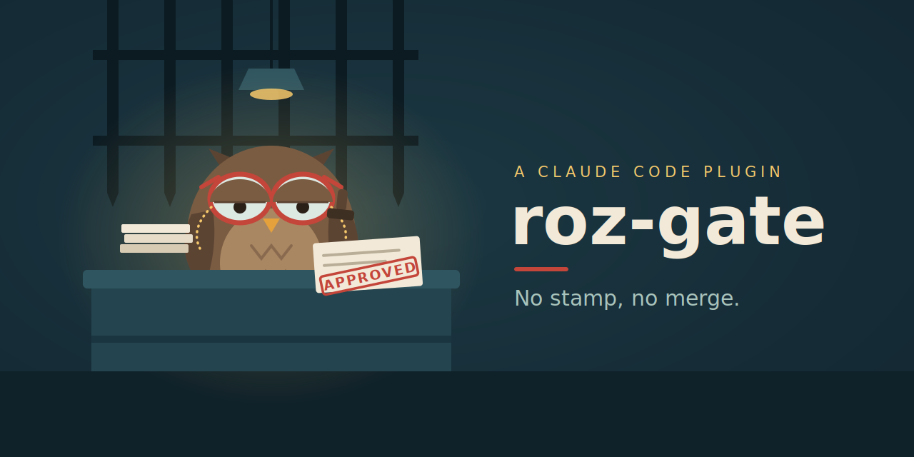

# Roz Gate — an AI-agent development workflow, as a Claude Code plugin



**[▶ Interactive guide](https://taikerliang.github.io/roz-gate/)** — the loop,
the labels, an issue's life, and "what should I do now?", in one clickable
page (EN/中).

Roz Gate turns a repository into a **role-driven, human-gated development
pipeline** run by a team of specialized AI agents: a product advocate, an
engineering manager, an implementer, a black-box QA tester, and an independent
reviewer. Agents do the work; **you make every decision that matters** — the
pipeline stops at explicit gates and cannot cross them without you.

Works with **GitHub (`gh`) and GitLab (`glab`)**, gitlab.com or self-hosted.

```
(1) intake → (2) spec → (2a) Q&A → (3)(4) impl ∥ QA → (5) review → (6) verdict → (7) merge
      ▲gate            ▲gate                                                    ▲gate
```

## Why

A single AI assistant asked to "build and test the feature" grades its own
homework: its misunderstandings flow into the code *and* the tests, so green
proves nothing. Roz Gate splits the work across agents with strict
information walls — the QA agent **never sees the implementation**; it writes
black-box tests from the spec and a technical contract only, and the two sides
meet for the first time at an **integration verdict**. Disagreements surface as
real test failures before merge, not in production. Every open question an
agent hits stops the line and comes to you as a written, answerable thread —
agents are forbidden to guess.

## Requirements

- Claude Code with this plugin installed
- `gh` (GitHub) **or** `glab` (GitLab) authenticated for the repo's host
- A git repo on that forge, with issues and PRs/MRs enabled
- A test runner invocable from the CLI

## Install

```
# GitHub-hosted:
/plugin marketplace add <owner>/roz-gate
# or any git host (GitLab, self-hosted):
/plugin marketplace add https://<host>/<path>/roz-gate.git

/plugin install roz-gate@roz-gate-marketplace
```

Then, inside each project you want to run the loop in:

```
/roz-gate:init
```

`init` is one-time and idempotent. It detects the forge from your git remote,
creates the labels, writes a workflow pointer + a small config block into
your project's `CLAUDE.md` (the workflow doc itself stays in the plugin, so
upgrades apply everywhere at once), **seats the agent team** — if you already
have agents you like, it links them into the fixed role seats instead of
replacing them; the rest default to the plugin's — and adds an "Idea" issue
template for mobile capture.

## The loop in one page

| Stage | Who | Deliverable |
|---|---|---|
| (1) Intake | main agent + you | one issue = one user story, with observable acceptance criteria and a `track:` label |
| (2) Spec | em + product + implementer | `spec.md` (scenarios) + `technical-spec.md` (the contract), opened as the **spec CR** |
| (2a) Q&A | you + role agents | every open question a thread on the spec CR; your answers folded back into the spec |
| (3) Implementation | implementer | `feat/{n}`: code + unit tests |
| (4) Black-box QA | qa | `qa/{n}`: test plan + acceptance suite — written blind, from spec + contract only |
| (5) Review | reviewer | severity-graded inline threads (`blocking`/`should-fix`/`nit`/`question`) until review-clean |
| (6) Integration | main agent | both branches merged locally, QA's suite runs against the code for the first time — **the verdict** |
| (7) Merge | **you** | you review the spec CR (spec + code + tests + green verdict) and merge |

**The mental model: owner, contractor, inspector.** The loop is the
time-honoured commercial structure for buying work you cannot fully watch:

| Stage | Commercial counterpart |
|---|---|
| (1) Intake | the **MOU** — intent, scope, roughly how big; no binding terms |
| (2) Spec + (2a) Q&A | **contract** drafting + negotiation rounds — each open thread a clause you settle |
| (3) Implementation | performance — the contractor builds |
| (4) Black-box QA | the third-party inspector writes the acceptance procedure **in advance, from the contract alone** — never visiting the site |
| (5) Review | site supervision — checks workmanship, not outcomes |
| (6) Integration | **acceptance** — the procedure meets the finished work for the first time; the verdict |
| (7) Merge | the owner signs off and the deal closes |

Two structural carry-overs give the verdict its credibility. The acceptance
procedure is written in parallel with the build, blind — a standard agreed
after construction, together with the builder, is theatre (the qa branch
carrying no implementation code enforces this). And a contract ambiguity
mid-build is never interpreted by the contractor: it goes back through a
**change order** — (2a), the loop's only backward transition. You are the
owner throughout: you sign (gate labels, the merge) and never build. Small
deals (`track: fast`) skip the contract and close on the MOU alone.

> **Note — the test port.** QA drives the system only through the contract.
> For an HTTP feature the contract is the API doc, so black-box testing is
> natural. A feature with **no natural external interface** — a scheduled job,
> a bot command, an internal service — still owes QA a front door: the
> implementer must ship a **test port** as part of `technical-spec.md`, a
> small, documented, stable driver the acceptance tests call instead of
> reaching into internals. Example: offer expiry runs on a schedule, so the
> port exposes `advance_clock(minutes)`, `run_expiry_sweep()`, and
> `get_offer_state(id)` — control and observation points, nothing internal.
> Because the port is promised in the contract at stage (2), QA can write its
> suite in parallel with the build; because it exposes only observable
> behaviour, the tests survive refactors and the black box stays sealed. In
> hexagonal-architecture terms: a driving port whose actor is the acceptance
> suite — the inspector's access hatch, reserved in the contract, never a
> hole cut in the fence. A port that "conveniently" exposes internals defeats
> the point; treat that as a contract defect.

**Two tracks.** Design-bearing stories take the full loop (`track: spec`).
Mechanical changes (chores, config, doc fixes) take the **fast track**
(`track: fast`): direct implementation + review + your merge, with an
**escalation valve** — the moment a fast change grows a real decision, it is
relabelled back onto the spec track.

**Three gates, all yours.** `status: ready-for-spec` (design this),
`status: ready-for-dev` (build this), and the final merge. Commands and agents
never apply gate labels — structurally, the machine can run the pipeline but
cannot authorize it.

## Commands

| Command | What it does |
|---|---|
| `/roz-gate:init` | one-time repo bootstrap (labels, config, personas, templates) |
| `/roz-gate:to-issues` | live intake: the `product` agent (under the intake brief) clarifies your idea one question at a time; the main agent only relays and publishes the confirmed story — one issue = one story |
| `/roz-gate:next-stage [n]` | advance one gated issue — spec stage, parallel impl+QA+review, or fast track — routed by its labels; prints the workflow map first |
| `/roz-gate:spec-answers [n]` | fold your answers on spec-CR threads back into the spec, resolve the threads |
| `/roz-gate:integrate [n]` | run the stage-(6) verdict: merge locally, run the acceptance suite, classify red, finalize green |
| `/roz-gate:patrol` | one supervisory pass: scan every open issue's state, invoke whichever command is already authorized, triage the inbox, report what waits on you |
| `/roz-gate:uninit` | retire the loop from this repo: verify nothing is in flight, remove the scaffolding `init` installed, keep every work product — run before `/plugin uninstall` |

Run `/roz-gate:patrol` manually as a "what's next" button, or schedule it
(e.g. every 30 minutes) for an unattended loop — it acts on one in-loop issue
per pass but triages the whole inbox every pass, treats the `processing` label
as a lock, and never applies a gate label.

## The inbox: filing ideas from your phone

Open an issue from the forge's mobile app with **no labels** — two rough
sentences are enough (the "Idea" template `init` installs reminds you). An
issue with no `track:` label is the **inbox**: invisible to the rest of the
loop. Patrol triages it *in the comments*: all open clarifying questions
batched into one comment (prefixed `**[intake]**`, numbered, each with a
recommendation — a comment round trip costs a day, so nothing is asked
serially), answered by you from any device. When the story is clear it posts a proposal — rewritten story +
acceptance criteria + suggested track — and only after you reply `approve` does
it rewrite the issue body and apply the track label. The gate label is still
yours to apply, whenever you're ready.

Both intake paths run the same brain: the `product` agent dispatched under
`references/intake-brief.md`. The orchestrator never does clarification
thinking in its own context — it relays, posts, and publishes.

## Labels & state machine

| Label | Kind | Applied by |
|---|---|---|
| `track: spec` / `track: fast` | track | intake, after your confirmation |
| `status: ready-for-spec` / `status: ready-for-dev` | **gate** | **you, only ever you** |
| `status: in-spec-review` | transient | spec stage (also the mid-flight re-entry state for QA ambiguities) |
| `status: in-user-review` | transient | main agent — finished, verified work waiting on your review |
| `status: processing` | lock | any running command; coexists with the phase label (a stale pair = crash forensics) |
| `status: blocked` | transient | a stopped command — evidence + recommendation posted as an issue comment; you decide |

No `track:` label = inbox (pre-loop). No `status:` label = in flight (the open
CRs are the state). Commands validate invariants and **stop on violations —
they never repair labels**.

Every state-mutating command has exactly two exits: **Done** (deliverable
produced, lock removed) or **STOP** (discard local work, set `blocked` alone,
post evidence + a recommended next step). No third exit — so any terminal state
is readable from the labels alone.

## Forge support

Commands are written against ~12 named forge operations (LABEL-ADD,
CR-OPEN-DRAFT, THREADS-LIST, THREAD-RESOLVE, …). Two adapters map them to
concrete CLI:

- `references/forge-github.md` — `gh` (+ GraphQL for review threads)
- `references/forge-gitlab.md` — `glab` (REST discussions API)

Notable GitLab differences, handled by the adapter: MRs instead of PRs; inline
threads need the MR's diff SHAs; and labels use **scoped labels**
(`track::spec`, `status::ready-for-dev`) so the platform itself enforces
"exactly one track, at most one status" — while the `processing` lock stays a
plain label on purpose, because it must *coexist* with the phase label it
locks. Issue templates live at `.github/ISSUE_TEMPLATE/idea.md` vs
`.gitlab/issue_templates/idea.md`.

Adding another forge = writing one more adapter file with the same operation
names; no command changes.

## Per-project configuration

`init` writes a `### Roz Gate config` block into your `CLAUDE.md`; every
command reads it before acting:

```
- forge: github | gitlab
- default_branch: main
- test: <full-suite command>            e.g. uv run pytest / npm test
- acceptance_dir: tests/acceptance
- acceptance_test: <one feature's acceptance command>
- env_sync: <dependency sync command>   e.g. uv sync / npm ci
- lockfile: <lockfile name>             the only mechanical merge carve-out
- lockfile_regen: <regen command>
- specs_dir: docs/specs
```

`init` also writes a `### Roz Gate personas` block — **fixed seats, swappable
occupants**. The five role names (product, em, implementer, qa, reviewer) are
the workflow's vocabulary and never change; each seat maps to the subagent
actually dispatched. Already have a `backend.md` you've tuned for months?
Link it — your file stays yours, unmoved and unrenamed:

```
- product: roz-gate:product        ← plugin default
- em: roz-gate:em
- implementer: backend             ← your existing agent, seated
- qa: roz-gate:qa
- reviewer: roz-gate:reviewer
```

**Persona is swappable; the contract never is.** Every dispatch attaches the
seat's Owns/Never contract (qa never reads the implementation, the reviewer
never writes code, …) — and at link time `init` reads your agent against its
seat's contract and flags text that fights it, so a linked persona can't
quietly break the loop's information walls. An unlinked implementer seat gets
the classic treatment: the plugin's charter template instantiated into
`.claude/agents/implementer.md`, its `## Stack` section filled with *your*
stack's anti-patterns.

## Adopting on a less mature project

Don't turn everything on at once. The staged path, each stage stable on its
own: **(1)** independent review only — route every AI diff through the
reviewer; **(2)** add the spec stage + Q&A threads for one real feature;
**(3)** add blind QA + the integration verdict; **(4)** add patrol when enough
work is in flight that manual advancement is the bottleneck. A project with no
tests should start at (1) and build test culture before (3) can mean anything.

## Leaving Roz Gate

Retirement is two steps, **in this order**:

1. In **each** adopted project: `/roz-gate:uninit`. It refuses to run
   mid-flight (open issues with `track:`/`status:` labels, open loop CRs),
   then removes what `init` installed — the CLAUDE.md section, the
   `implementer` persona (asked first), the idea issue template. Forge labels
   are **kept** by default: deleting them would erase them from closed issues'
   history; ask explicitly if you want them gone. Specs and the acceptance
   suite are work products, never touched — from that point they're ordinary
   project assets.
2. Only when every project is clean: `/plugin uninstall roz-gate`. Order
   matters — uninstalling first deletes `/roz-gate:uninit` along with the
   plugin, leaving the cleanup to you by hand.

## Design principles (the short version)

1. One accountable orchestrator; specialists never share a session.
2. Roles are defined by what they must **not** do — that's what buys
   independent derivations.
3. Contracts, not conversations: exchanges between agents are written and on
   the record, or don't happen at all (QA).
4. Implementation and QA run in parallel, blind; the verdict at integration is
   the only honest "does it match the spec".
5. Ambiguity stops the line — agents surface questions, never guess.
6. Humans hold the gates; the machine cannot authorize itself.
7. State lives in labels and CRs, never in a session — crash-safe, auditable,
   schedulable.

## Troubleshooting

- **Stale `processing` + a phase label** — a run was killed mid-flight. Look at
  what the dead run left (the phase label says where), clear the lock, re-run;
  commands are idempotent on re-entry.
- **`status: blocked`** — read the issue comment: evidence + recommendation.
  Decide, clear the label; the step re-runs from clean state.
- **Illegal label state reported** — a command found an invariant violation and
  stopped on purpose. Fix the labels by hand (you have the evidence); commands
  never repair labels themselves.
- **QA CR never leaves draft** — QA is paused on an open question; check the
  spec CR for an unresolved thread, or the issue for `in-spec-review`.

## License / provenance

Extracted from a working single-repo implementation of the methodology
described in *AI-Native Software Development: The Roz Gate* — role charters,
label state machine, STOP protocol, and the integration-verdict design are
ports of that system, generalized and made forge-neutral.
